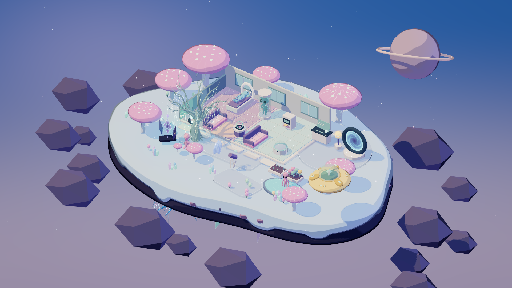
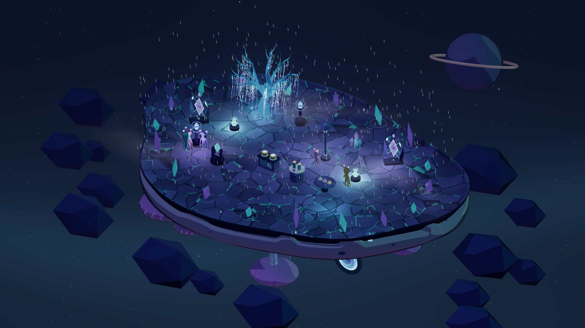
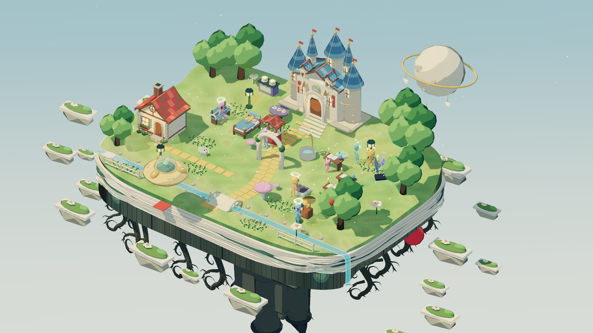
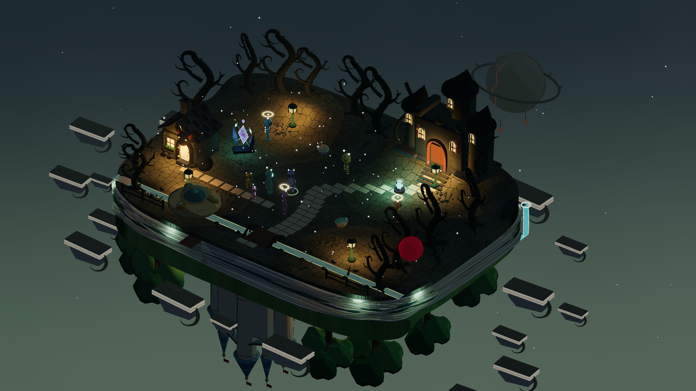

# Orbit Life

<p align="center">
  <a href="https://www.doudouai.net:6443/">
    
    
  </a>
</p>

<p align="center">
  
  
</p>

[中文](README.md) · **English**

**A small alien world that lives on its own.**

On a rotatable **3D island with two sides**, alien residents eat, work, make friends, grow mushrooms, and raise the next generation autonomously. Take control of one resident and design their home, or simply observe as the bay develops its own stories.

**Autonomous AI · life and genetics · species awakening · free placement · persistent simulation · phone / desktop viewing**

**Play locally or deploy to your own server.** Keep a private bay or invite friends to watch the same world.

| Mode | URL | Best for |
| --- | --- | --- |
| **Local** | [http://127.0.0.1:5173/](http://127.0.0.1:5173/) (default port **5173**) | Playing and developing on Windows / macOS |
| **Self-hosted** | `https://your-domain:6443/` (domain and port are configurable) | Shared phone / desktop viewing with simulation continuing after the page closes |

### [Open the online demo →](https://www.doudouai.net:6443/)

Enter the running bay, switch resident viewpoints, and watch their everyday lives. Users with a Token can claim control of the shared world.

[Highlights](#highlights) · [Quick start](#quick-start) · [Deployment](DEPLOYMENT.md) · [Development and verification](#development-and-verification)

## Highlights

### Autonomous lives, distinct personalities

**Needs, personality, interests, careers, and relationships drive decisions together.** Residents find food, care for infants, work for credits, pursue hobbies, and talk with neighbors. Each resident has their own skills, money, and social history.

Switch the controlled resident at any time, or enable autonomy and let the local AI plan around needs and interests.

### One island, two atmospheres

Flip between the **daylight and shadow sides** of the island and build two distinct homes. Residents cross warp gates between sides, while star routes extend the world into further exploration.

Day and night, star mist, light rain, and spore wind change with simulation time. Pastel toon rendering, glowing plants, gates, and soft bloom give each side its own mood.

### Stories across generations

**Incubation -> infant care -> growth -> work -> aging -> inheritance.** Residents have parents, children, life stages, and inheritable traits. Skin tone, body shape, head proportions, and antennae influence the next generation, with models and portraits changing as residents grow.

### Prayer leaves visible changes

Pray at the spirit tree to build **Radiance / Nether traits**, unlock species awakening, and gain permanent visual mutations.

- **Radiant**: a floating halo and gentle light.
- **Nether**: a translucent body and Nether-eye pattern.
- **Many mutations**: crystal crown horns, spine crystals, starlight spots, and heterochromia can combine into a distinct appearance.

### Grow mushrooms and build a garden

Residents can choose planting locations themselves or follow your placement. Mushrooms cost seeds, need care, and can mature as **giant, clustered, or mutated** crops.

Plant, tend, harvest, and replant. Harvests sell automatically; ordinary crops provide steady income while rare combinations add surprises.

### Shape a home and a career

Buy, rotate, place, and sell furniture from themed packs. Beds support sleep, sofas support conversations, and research, cooking, gardening, and music each have dedicated facilities and actions.

Six needs, skill growth, career promotion, and a credit economy form the everyday loop. Furniture placement and reachability affect what residents can do.

## The bay keeps living after you close the page

Deploy the bay to a server for a **persistent life simulation**. Residents keep working, socializing, and tending plants while you are away. Return later to see what changed, or pause the world while planning.

| Capability | Experience |
| --- | --- |
| **Live sync** | WebSocket delta updates keep multiple browsers on the same world |
| **Smooth presentation** | Resident movement and daily actions are presented continuously |
| **Shared viewing** | Phones, Windows, and macOS browsers can watch the same world |
| **Single operator** | Token verification lets one page claim control; other pages become read-only |
| **Automatic saves** | Resident growth and home layout continue from the saved state |
| **Visitor statistics** | Verified users can view visits, country / region aggregation, and a 30-day daily unique-IP chart |

## Quick start

### Local play

Requires **Node.js 22.12+** and a modern browser with **WebGL 2**.

```sh
npm ci
npm run dev
```

Open [http://127.0.0.1:5173](http://127.0.0.1:5173). On Windows, double-click `启动游戏.bat`; on macOS, double-click `start-game.command`.

Local progress runs with the game and is stored in `.data/orbit-life.json`.

### Self-hosted mode

Follow [the deployment guide](DEPLOYMENT.md) to configure `deploy.config.json`, SSH keys, and the server environment, then run:

```sh
npm run deploy
```

The deployment script runs tests, builds, uploads, backs up saves, and performs a health check. macOS / Windows launchers are `deploy.command` / `deploy.cmd`.

## Controls

| Action | Function |
| --- | --- |
| Click a resident / object | Open the interaction menu |
| Click open ground | Queue a walk |
| Resident portrait / profile | Inspect residents; deployed visitors can switch viewpoints |
| Autonomy toggle | Let the controlled resident choose actions |
| Right-drag / middle-drag / wheel | Rotate / pan / zoom |
| Space / 1 / 3 | Pause / normal speed / 3x speed |
| B / R / Esc | Build / rotate the selected item / cancel |

The narrow-screen interface includes in-game camera and interaction controls for phones.

## Development and verification

**Three.js · JavaScript · Vite · Node.js · WebSocket · Blender · Playwright**

Original Blender models and rigged animations are rendered with Three.js. Local and server modes share the same simulation core and load the packaged model assets at runtime.

| Path | Responsibility |
| --- | --- |
| `src/simulation.js` | World state, actions, AI, economy, and save rules |
| `src/world.js`, `src/character-rig.js` | 3D scene, camera, residents, and animation |
| `src/npr.js`, `src/prayer-visuals.js` | Stylized rendering, species, and mutations |
| `src/plants.js`, `src/genetics.js` | Crops and inheritance |
| `src/online-client.js`, `server/` | Online sync, authority, authentication, and persistence |
| `src/i18n.js` | System-language detection, manual language selection, and UI translation |
| `scripts/` | Build, deployment, and migration tools |
| `public/assets/`, `tools/` | Game assets and model tools |
| `tests/` | Simulation, protocol, UI, and browser tests |

```sh
npm test
npm run build

# Local browser tests; see playwright.config.js
npx playwright test

# Deployment build and online-mode tests
npm run build:online
npm run test:online
```

## Acknowledgements

Three.js, Lucide, Vite, and other dependencies follow their respective licenses. GeoLite2 data used for country / region aggregation comes from MaxMind; see [the deployment guide](DEPLOYMENT.md) for the notice.
