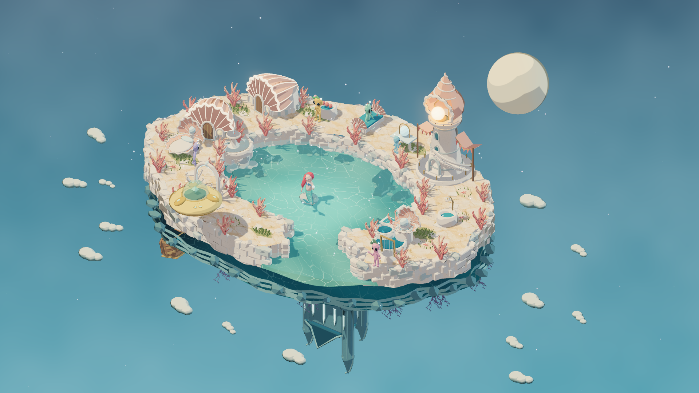
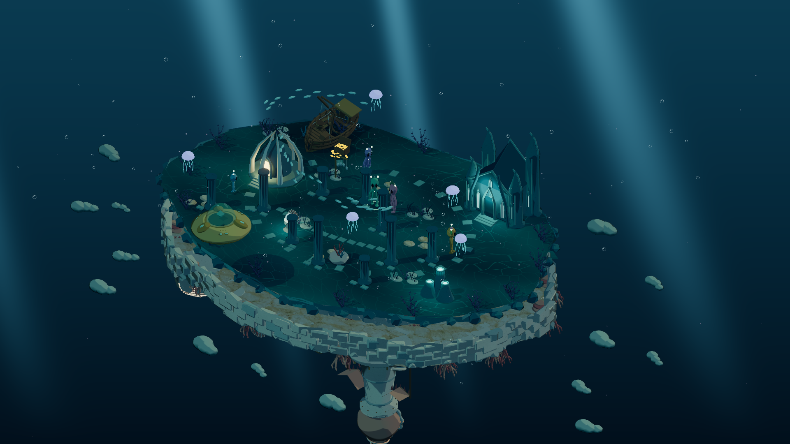

# 星外日常 · Orbit Life

<p align="center">
  <a href="https://www.doudouai.net:6443/">
    
    
  </a>
</p>

<p align="center">
  
  
</p>

<p align="center">
  
  
</p>

**中文** · [English](README.en.md)

**一个会自己生活的外星小世界。**

在可翻转的 **3D 双面星岛** 上，外星居民会自己吃饭、工作、交朋友、种蘑菇和养育下一代。你可以接管一位居民，设计他们的家，也可以只做旁观者，看这座小小星湾慢慢长出自己的故事。

**自主 AI · 生命与遗传 · 种族觉醒 · 自由布置 · 后台持续模拟 · 手机 / 电脑共享观看**

**本地游玩，或部署到自己的服务器。** 独享一座星湾，也可以邀请朋友一同观看。

| 运行方式 | 访问地址 | 适合场景 |
| --- | --- | --- |
| **本地运行** | [http://127.0.0.1:5173/](http://127.0.0.1:5173/)（默认端口 **5173**） | 在自己的 Windows / macOS 电脑上启动，独立游玩与开发 |
| **远端运行（自行部署）** | `https://你的域名:6443/`（域名与端口可配置） | 部署到自己的服务器，手机 / 电脑共享观看，关闭网页后仍继续模拟 |

### [进入在线 Demo →](https://www.doudouai.net:6443/)

打开浏览器，走进正在运行的星湾。**自由切换人物视角，观看居民的日常**；持有 Token 的用户可以获取操作权，接管这座共享世界。

[玩法亮点](#玩法亮点) · [快速开始](#快速开始) · [自己部署](DEPLOYMENT.md) · [开发与验证](#开发与验证)

## 玩法亮点

### 自主生活，各有性格

**需求、性格、兴趣、职业和关系共同驱动自主决策。** 居民会寻找食物、照顾幼体、工作赚取星币，也会开展兴趣活动、与邻居交流。每位居民都有自己的技能、资金和人际关系。

随时切换主控居民，亲自安排一天的生活；也可以开启自主模式，让他们按照自己的需求与兴趣行动。**内置自主 AI，开箱即玩。**

### 一座星岛，两种风景

翻转星岛，在 **晴昼面与幽星面** 之间切换，布置风格迥异的家园。居民穿过折跃门往返两面，航路与星岛旅行进一步延伸探索空间。

日夜、星雾、微雨与孢子风随模拟时间变化。粉彩 Toon 渲染、发光植物、星门和柔和泛光，让晴昼家园与背面的幽光世界拥有不同气质。

### 从一个居民，到几代人的故事

**孕育 → 幼体照料 → 成长 → 工作 → 衰老 → 传承。** 居民拥有亲代、子女、年龄阶段和遗传特征；肤色、体型、头型与触角等外观会影响下一代，模型与头像随成长同步变化。

照顾幼体、陪伴子女成长，看他们成年后开始自己的生活。亲缘关系与人物记录串起几代居民的故事。

### 祈祷会留下真正可见的变化

在星灵树前祈祷，积累 **曦光 / 幽冥属性**，解锁种族觉醒与永久外观变异。

- **曦光族**：头顶悬浮光环，带有柔和圣光。
- **幽冥族**：半透明身体与幽冥眼花纹，头像同步呈现。
- **多种外观变异**：晶冠角、圆润脊晶、星辉斑、异色瞳自由组合，形成独特外观。

### 种下蘑菇，等一个惊喜

居民可以自主选址种植，也可以由你指定位置。蘑菇需要支付种子费用、浇水养护，成熟时有机会出现 **巨型、多株、变异**，而且这些属性可以叠加。

**种植、养护、收获、再播种**，经营自己的孢子花园。农产品收获后自动出售，普通作物带来稳定收入，稀有组合带来额外惊喜。[查看种植规则](docs/mushroom-crops.md)

### 布置家园，发展事业

用不同物品包布置家园，购买、旋转、摆放和出售家具。床可以睡、沙发可以一起聊天，研究、烹饪、园艺和音乐都有对应设施与动作。

**六项生活需求、技能成长、职业晋升与星币经济** 组成生活循环。家具的摆放位置与可达性，也会影响居民的日常。

## 关掉网页，星湾仍在生活

将星湾部署到服务器，开启 **持续运行的生活模拟**。关掉网页后，居民仍会工作、社交、照料植物；再次回来时，继续观察他们的新日常。你也可以随时暂停，慢慢规划下一步。

| 能力 | 体验 |
| --- | --- |
| **实时同步** | WebSocket 增量推送，让各个浏览器同步看到星湾的变化 |
| **平滑呈现** | 连贯呈现人物移动与日常动作 |
| **多人围观** | 手机、Windows、macOS 浏览器查看同一个世界，各自切换观看视角 |
| **单端操作权** | Token 验证后主动获取控制，最后获取者可操作，前一个页面回到只读 |
| **自动存档** | 保存居民成长与家园进度，下次访问继续生活 |
| **访问统计** | 验证用户可查看总访问人次、IP 国家 / 地区及近 30 天每日独立 IP 曲线 |

## 快速开始

### 本地游玩

需要 **Node.js 22.12+** 与支持 **WebGL 2** 的现代浏览器。

```sh
npm ci
npm run dev
```

打开 [http://127.0.0.1:5173](http://127.0.0.1:5173)。也可在 Windows 双击 `启动游戏.bat`，或在 macOS 双击 `start-game.command`。

本地模式随游戏页面运行，进度保存在 `.data/orbit-life.json`。

### 远端运行

按 [部署指南](DEPLOYMENT.md) 配置私有的 `deploy.config.json`、SSH 密钥及服务器环境，然后运行：

```sh
npm run deploy
```

部署脚本自动完成测试、构建、上传、存档备份与健康检查。macOS / Windows 分别提供 `deploy.command` / `deploy.cmd`。服务器配置、存档迁移与安全设置见 [部署指南](DEPLOYMENT.md)。

## 常用操作

| 操作 | 功能 |
| --- | --- |
| 点击人物 / 物品 | 打开互动菜单 |
| 点击空地 | 安排行走 |
| 居民头像 / 人物页 | 查看居民；部署版访客也可切换观看视角 |
| 自主开关 | 切换主控居民的自主行动 |
| 右键拖动 / 中键拖动 / 滚轮 | 旋转 / 平移 / 缩放 |
| 空格 / 1 / 3 | 暂停切换 / 正常 / 三倍速度 |
| B / R / Esc | 建造 / 旋转待摆物品 / 取消 |

手机使用适配窄屏的界面，通过屏幕内控件调整镜头与选择互动。

## 开发与验证

**Three.js · JavaScript · Vite · Node.js · WebSocket · Blender · Playwright**

原创 Blender 模型与蒙皮骨骼动画，配合 Three.js 风格化渲染。本地与服务器模式共用游戏模拟核心，运行时直接加载打包好的模型资产。

| 路径 | 职责 |
| --- | --- |
| `src/simulation.js` | 世界状态、行动、AI、经济与存档规则 |
| `src/world.js`、`src/character-rig.js` | 3D 场景、摄像机、角色与动画 |
| `src/npr.js`、`src/prayer-visuals.js` | 风格化渲染、种族与变异外观 |
| `src/plants.js`、`src/genetics.js` | 种植与遗传 |
| `src/online-client.js`、`server/` | 在线同步、权威模拟、鉴权与持久化 |
| `scripts/` | 构建、部署与迁移 |
| `public/assets/`、`tools/` | 游戏资产与模型制作工具 |
| `tests/` | 模拟规则、同步协议与浏览器测试 |

```sh
npm test
npm run build

# 本地浏览器测试；环境配置见 playwright.config.js
npx playwright test

# 部署版构建与在线模式测试
npm run build:online
npm run test:online
```

## 致谢

Three.js、Lucide、Vite 等依赖遵循各自许可证；IP 归属地统计所用 GeoLite2 数据来自 MaxMind，相关声明见 [部署指南](DEPLOYMENT.md)。
